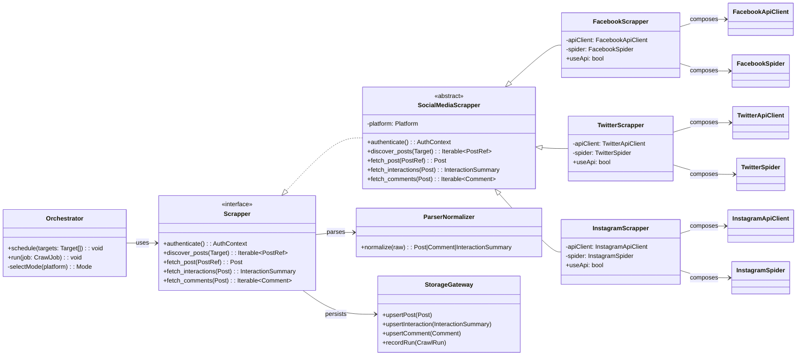
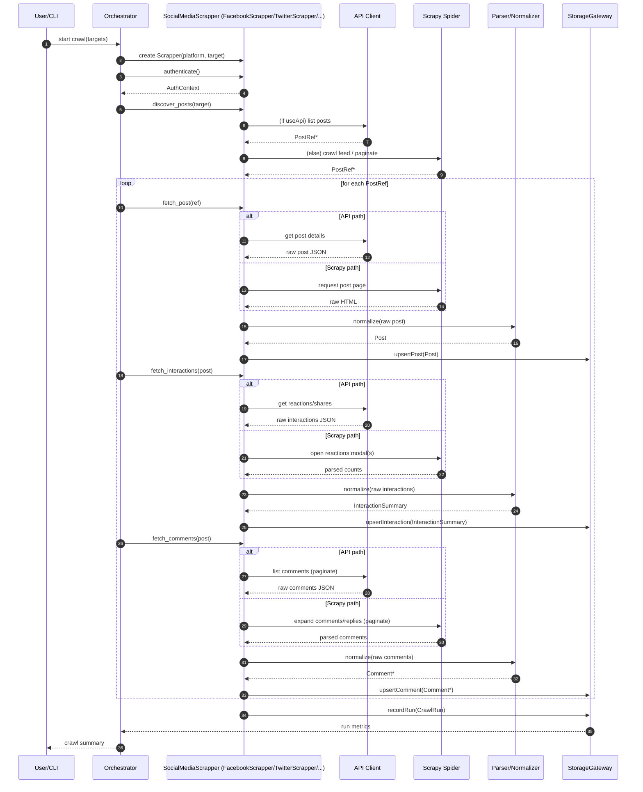

# Social Media Scraping Application — Requirements & UML

> Target audience: product & engineering stakeholders

---

## 1) Executive Summary

Build a modular social media data collection system that prefers **official platform APIs** when available (e.g., Meta Graph API), and **falls back to HTML scraping using Scrapy** when APIs are unavailable or insufficient. The system must capture **posts** and their **interactions** (reactions/likes, comments, shares, and commenters) in a compliant, rate‑limited, and observable way.

---

## 2) Goals & Non‑Goals

**Goals**

- Unified pipeline to collect per‑post content and interactions across platforms.
- Pluggable “Scrapper (aka Scrapper)” architecture with platform‑specific implementations (Facebook, X/Twitter, Instagram, LinkedIn, etc.).
- Prefer API-based collection when possible; fallback to Scrapy.
- Scalable scheduling, retries, and storage with strong observability.

**Non‑Goals**

- Circumventing platform security (e.g., CAPTCHAs, MFA) or violating ToS.
- Real‑time firehose ingestion of all public content.
- Building a complete analytics UI (only basic status dashboards/logs are in scope).

---

## 3) Functional Requirements

1. **Source Coverage**
   - Support: Facebook (API+Scrapy), X/Twitter (API or Scrapy), Instagram (API+Scrapy), LinkedIn (API or Scrapy), Reddit (API+Scrapy), TikTok (Scrapy+JS rendering), YouTube (API).
2. **Data Collected per Post**
   - Post metadata: ID, permalink/URL, author handle & profile URL, timestamp, text, media URLs, hashtags/mentions, geo (if present).
   - Interaction metrics: reactions/likes (with type breakdown where available), comments count, shares/retweets/reposts count, views/impressions (if available), bookmarks (if available).
   - **Comments & Replies**: commenter identity (name/handle/profile URL), text, timestamp, reaction counts per comment when available; nested replies.
3. **Acquisition Modes**
   - **API Mode**: Use official APIs with authenticated app or user tokens; respect quotas.
   - **Scrapy Mode**: HTML scraping with selectors; optional JS rendering (Splash/Playwright plugin) for dynamic content.
4. **Scheduling**
   - Periodic crawls per source (cron rules), on‑demand backfills by date range, and webhook‑triggered runs.
5. **Deduplication & Idempotency**
   - Deduplicate by canonical post ID or normalized URL; upsert behavior for updates.
6. **Rate Limiting & Backoff**
   - Adaptive per‑source rate limits; exponential backoff on throttling and 429/5xx.
7. **Error Handling & Retries**
   - Configurable retry policy; circuit breaker per source.
8. **Monitoring & Observability**
   - Metrics: pages/min, success/error rates, average latency, items extracted/min, per‑source quota usage.
   - Logs: structured JSON logs with correlation IDs.
   - Alerts: failure spikes, captcha detection, auth token expiry.
9. **Data Access**
   - Write to OLTP store (PostgreSQL or MongoDB) and stream to a warehouse (BigQuery/Snowflake) via CDC/ETL.
   - Exporters: Parquet/NDJSON to object storage.
10. **Configuration**
    - Per‑platform YAML/TOML configs: rate limits, endpoints, selectors, feature flags (API vs Scrapy), auth secrets (via vault), and scheduling.

---

## 4) Non‑Functional Requirements

- **Compliance & Ethics**: Respect platform ToS, user privacy, and consent; store only minimally required PII; support data deletion requests.
- **Security**: Secrets in a vault, TLS everywhere, least‑privilege IAM, audit logs.
- **Performance**: Crawl 10–100 pages/min per worker under normal conditions.
- **Scalability**: Horizontal scaling via worker pool; stateless orchestrator.
- **Reliability**: 99% successful extraction for supported pages; no‑data loss semantics for committed items.
- **Maintainability**: Clear abstractions; platform modules independently deployable.

---

## 5) System Architecture (High Level)

- **Ingestion Orchestrator** (service): resolves target → chooses API or Scrapy → schedules jobs.
- **Scrapper Abstraction** (`Scrapper` interface): common methods (`authenticate`, `discover_posts`, `fetch_post`, `fetch_interactions`, `fetch_comments`).
- **Platform Implementations**: `FacebookScrapper`, `TwitterScrapper`, etc.
- **API Client Layer**: typed clients/wrappers for official APIs.
- **Scrapy Crawlers**: one spider per platform (selectors, pagination, expansion of modals/popups where needed).
- **JS Rendering Adapter**: optional Playwright/Splash middleware for dynamic content.
- **Parser/Normalizer**: map raw fields to unified schema.
- **Persistence**: OLTP (Postgres/Mongo), queue (Kafka/SQS), DW (BigQuery/Snowflake), object storage.
- **Observability Stack**: Prometheus/Grafana, ELK/Opensearch, Sentry.

---

## 6) Unified Data Model (Logical)

**Entities**

- `PlatformSource`: { id, name, auth\_mode, api\_enabled, rate\_limit }
- `Author`: { id, platform\_user\_id, handle, display\_name, profile\_url, verification, avatar\_url }
- `Post`: { id, platform\_post\_id, platform, author\_id, url, created\_at, captured\_at, text, media[], hashtags[], mentions[], geo, visibility }
- `InteractionSummary`: { id, post\_id, like, love, haha, wow, sad, angry, retweet/repost, quote, share, view\_count, bookmark\_count }
- `Comment`: { id, post\_id, parent\_comment\_id?, author\_id, text, created\_at, reactions\_breakdown }
- `CrawlRun`: { id, platform, mode(api|scrapy), start\_ts, end\_ts, success, items\_extracted, errors[] }

---

## 7) UML — Class Diagram

> **Note**: "Scrapper" is the conventional spelling for the abstraction (the prompt used "Scrapper"). Use either in naming conventions consistently.

---

## 8) UML — Sequence Diagram (End‑to‑End Crawl)

This diagram shows the orchestrated flow where API is preferred; Scrapy is a fallback when API is disabled/unavailable.

---

## 9) Component Details

**Orchestrator**

- Accepts a crawl spec (targets, date ranges, platforms, mode preferences).
- Splits work into jobs; pushes to queue; scales workers.
- Tracks per‑job context, deadlines, and backoff.

**Scrapper Implementations**

- Each platform module owns: auth, discovery, extraction, pagination rules, and anti‑bot mitigations.
- `useApi` feature flag toggles API vs Scrapy at runtime.

**Scrapy Layer**

- Spiders per platform with clear item pipelines.
- Middlewares: rotating User‑Agents, proxy pool, robots/ToS guardrails, retry/backoff, optional JS renderer (Splash or Playwright‑via‑scrapy‑playwright).

**Parser/Normalizer**

- Converts API/HTML results to the unified schema; applies text cleanup, URL normalization, timezone handling.

**Storage Gateway**

- Implements idempotent upserts; manages foreign keys; emits CDC to Kafka; batches writes.

**Secrets & Auth**

- Platform tokens and cookies in vault (e.g.,
